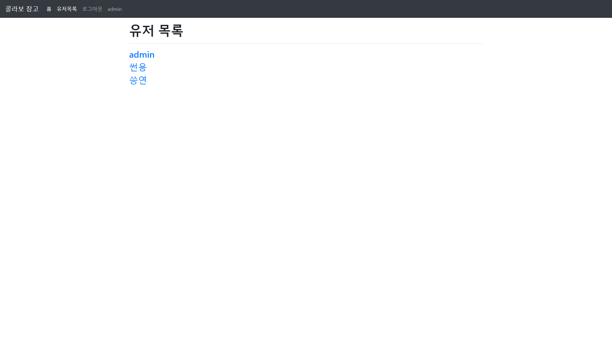

# PROJECT 10

Django를 활용해 모델링 + Github Flow 경험해보기.

## 프로젝트

메인화면


영화 세부 화면


유저목록



유저디테일


### 후기

Django 프로젝트에서 모델링은 이전에도 해본적이 있었기 때문에 어려운 작업은 아니었다. 오랜만에 해서 조금 헷갈리긴 했지만.. 

이번 프로젝트에서 메인은 협업이었다고 생각한다. 함께 모델링은 먼저 하고, 각 앱에서 각자의 기능을 branch를 나눠 개발해보았다. 서로 branch를 나눠 작업해 보는것이 처음이었기 때문에 사용법이 헷갈려서 초반에 헤매면서 시간이 많이 지났다. 하지만 한번정도 서로 기능을 만들고 pull request를 통해 merge를 하고 난 뒤에는 어느정도 능숙해져 큰 오류 없이 모든 프로젝트를 마칠 수 있게 되었다.

협업하며 개발하는 것이 어떻게 보면 어렵기도 했지만 굉장히 재밌기도 했다. 정말 좋은 경험이었다.

#### 이번에 사용한 Git 명령어 정리
```bash
git branch <new_branch_name> # 새로운 브랜치 생성
git branch -d <exist_branch_name> # 존재하던 브랜치 삭제
git checkout <exist_branch_name> # 현재 브랜치 변경
```

#### FIXTURE

```bash
python manage.py loaddata movies/fixtures/my_dumpdata.json
```